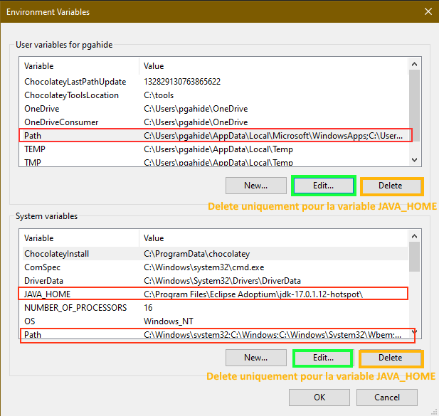

# Mise en place de l'environnement

Pour développer en Java, vous aurez besoin de :

- un Environnement de Dévelopement Intégré (IDE) ; nous utiliserons Visual Studio Code
- Java Development Kit (JDK)
- ensemble d'outils Java pour l'IDE

## Préparation

Pour éviter d'avoir des problèmes de compatibilité, il faut auparavant désinstaller toutes les versions précédentes du JDK qui pourraient être installées sur votre système.

### Suppression des JDK

- rendez-vous dans les paramètres de Windows
- Apps
- recherchez « jdk » dans la liste de programmes installés
- supprimez tous les jdk trouvés

### Suppression des entrées dans les variables d'environnement

La variable d'environnement PATH sur votre système contient un ensemble de répertoires qui sont parcourus lorsque le système tente de localiser un programme. Il se peut que les JDK désinstallés aient posé des entrées dans cette variable qui n'ont pas été supprimées. Il est important de les supprimer pour éviter tout problème d'incompatibilité par la suite. On va donc vérifier manuellement :

- rendez-vous dans les paramètres de Windows
- dans la recherche de paramètres, tapez « environ », localisez et ouvrez la fenêtre d'édition des variables d'environnement
- dans la liste des entrées « **variables utilisateur** » :
  - **ATTENTION : dans ce qui suit, ne supprimez surtout pas l'ensemble de la variable PATH**
  - localisez la variable PATH (si elle existe)
  - éditez-la (bouton) ; une liste de chemin s'affiche
  - vérifiez dans la liste des chemins si certains contiennent une référence à un JDK (ils contiendront la chaîne de caractères « jdk »)
  - supprimez-les tous le cas échéant
- toujours dans la liste des entrées « variables utilisateur » :
  - localisez la variable JAVA_HOME (si elle existe)
  - supprimez la variable complètement
- dans la liste des entrées « **variables système** » :
  - répétez le processus précédent pour les chemins contenus dans la variable PATH
  - répétez le processus précédent pour la variable JAVA_HOME (si elle existe)

Par exemple, sur le système suivant, ces trois entrées doivent être considérées :

Le système est maintenant prêt à accueillir un nouveau JDK.

## Visual Studio Code

Nous allons installer un _bundle_ (ensemble logiciel) pour Windows qui comprend tout ce dont on a besoin. Téléchargez et installez l'application suivante :

- [pour Windows](https://aka.ms/vscode-java-installer-win)
- [pour macOS](https://aka.ms/vscode-java-installer-mac)
- sous Linux, il faut faire l'installation « manuellement » (JDK + VS Code + extensions Java pour VS Code)

## Créer un projet Java

- ouvrez VS Code
- tapez`Ctrl+Shift+P` (`Shift` = `Maj` = touche avec une flèche au-dessus de `Ctrl`)
- la **palette de commande** s'ouvre : c'est un outil très utile sous VS Code qui permet d'accéder à toutes les fonctionnalités par simple recherche
- tapez `java`
- localisez et lancez `Create Java Project` dans la liste qui s'affiche
- sélectionnez `Maven` (si pas disponible, l'installation n'est pas correcte)
- tapez `junit5` dans le champ de recherche
- aucune proposition correspondante n'apparaît dans la liste, mais cliquez sur `More...`
- sélectionnez `java11-junit5`
- sélectionnez la dernière version disponible
- pour le nom du *package*, la convention généralement utilisée est de mettre le nom de domaine *inversé* de l'organisation (par exemple : `fr.dampierre`)
- pour l'*artifact*, tapez le nom de votre projet (par exemple `java-intro`)
- le système ouvre une fenêtre pour vous laisser choisir le répertoire dans lequel sera stocké votre nouveau projet
- parcourez l'arborescence pour localiser votre répertoire de projets Java (par exemple, vous pourriez avoir un répertoire `Java` sur votre bureau Windows)
- **Attention** : ne créez pas un répertoire spécifique pour le nouveau projet (Maven va le faire pour vous) ; indiquez juste votre répertoire de projets Java
- la suite se passe dans le terminal qui s'ouvre dans la partie inférieure de VS Code ; la création de projet est lancée
- la première fois, le gestionnaire de dépendances **Maven** va faire quelques téléchargements : une connexion internet est donc nécessaire pour cette phase
- au bout d'un moment, le processus va se stopper pour vous laisser indiquer le numéro de version de base de votre programme : laissé le numéro proposé (1.0-SNAPSHOT) et appuyez sur `Entrée` (il faudra peut-être donner le focus au terminal en cliquant dessus avant)
- confirmez le résumé donné avec `Y`
- Le projet est créé ; cliquez sur `Open` dans la popup qui s'ouvre ; VS Code se relance et le nouveau projet est chargé

